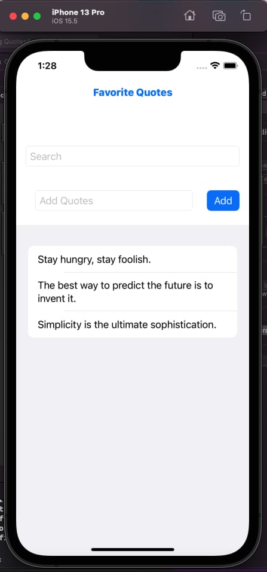

# 💬 QuotesApp

**QuotesApp** is a simple and elegant **SwiftUI** application that lets users manage their favorite quotes effortlessly.  
You can **add**, **edit**, **delete**, and **filter** quotes in a clean and minimal interface.

---

## ✨ Features

- ➕ **Add new quotes** easily  
- ✏️ **Edit quotes** with a simple tap  
- 🗑️ **Delete unwanted quotes** instantly  
- 🔍 **Search and filter quotes** quickly  
- 📱 Built with **SwiftUI** using the **MVVM** pattern 

---
## 📱 App Preview

